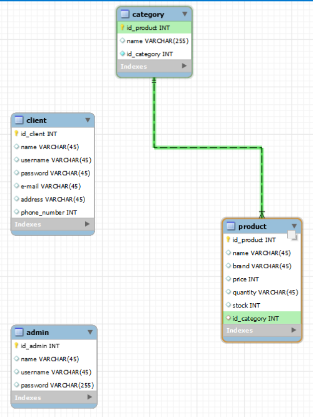

# ProiectPS - Fragrance Store

This project represents a **fragrances store** that contains products organised in two categories, dedicated for women and men with 2 types of users (Admin and Clients) for interfacing with the products in the shop.

## 

The project is built in the Spring Boot framework with MySQL data base server.
As main pattern we have a Controller that uses a Service to access the Repository which query the database, with models being the objects from the DB.

## Logic & Controller classes
Contain methods for **POST** and **GET** requests that are used to create, delete and edit clients. For **User** type models there are login and register methods too.
Every controller have one or more services that will actually process data and represent the logic component of the architecture.

## Service classes
Contain methods that parse data, create models, edit data.
Service classes are interfaces that are implemented by **serviceImpl** type classes that contains the actual implementation.
Returns values based on the request from the controller.
Every **serviceImpl** has one or more internal repositories field. 

## Repository 
Repositories are interfaces that extends JPA repositories, with some other functions added to ease the query tasks from the service. 

## Model

 - **Admin**
 - **Client**
 - **Product**
 - **Category**

 ## Models Relations
Category - Product have an **One to Many** relation. Every product has one category but one category has multiple products.

## Data Base Diagram

# UML diagrams
## Client

Client controller have 2 mandatory serivices that are the main logic of the application. Every Service have an mandatory repository to actually get the data from the DB. 

## Admin

Admin controller is the most basic controller the dependecies are straight forward controller needs a service, the service needs a repository and all the functions need the actual entity **Admin** for in method data processing hence the use arrows. 

The **AdminServiceImpl** implmentes **AdminService** interface

## Factory
The **Factory Pattern** is implemented with the Enum UserType which defines 2 different types of Users. The **UserFactory** class is the class that has the responsability to create a new **BasicUser** based on common input data for both **Client** and **Admin**.

**ClientServiceImpl** and **AdminServiceImpl** have composition dependecy with the **UserFactory** since there are fields for them instantiated when the service's constructor is called.

## Basic Users
The users hierarchy have in front the **BasicUser** interface that is implemented by the 2 types of users **Client** and **Adminf**.

## Android Application
Partea de frontend a aplicatiei este impartita in mai multe ferestre. La momentul rularii, aplicatia se dechide cu pagina de start, urmand ca mai departe sa putem vizualiza produsele. Din pagina de start se poate accesa fereastra de Login.

Pentru fereastra de vizualizare a produselor s-a folosit RecyclerView, iar pentru aceasta s-au format clasele Product, PAdapter (Adapter pentru clasa produselor) si functia de getUserData()/setUpProducts() din MainActivity. 

Legatura dintre backend si frontend este implementata in clasele MyApplication2, MyData, MyDataItem si ApiInterface unde se realizeaza operatia de "GET" pentru produse (parfumuri) pentru a fi afisate. 

